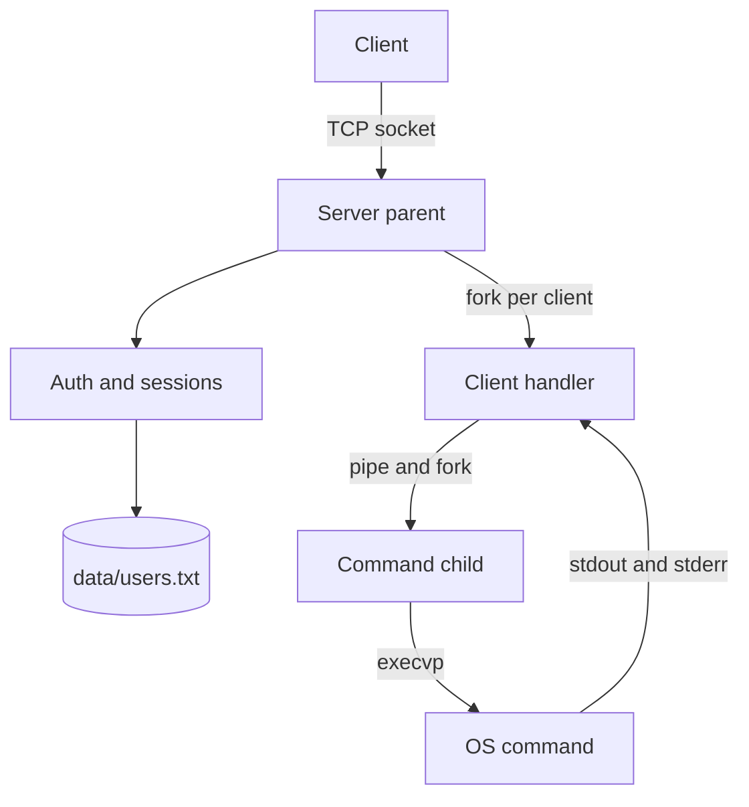
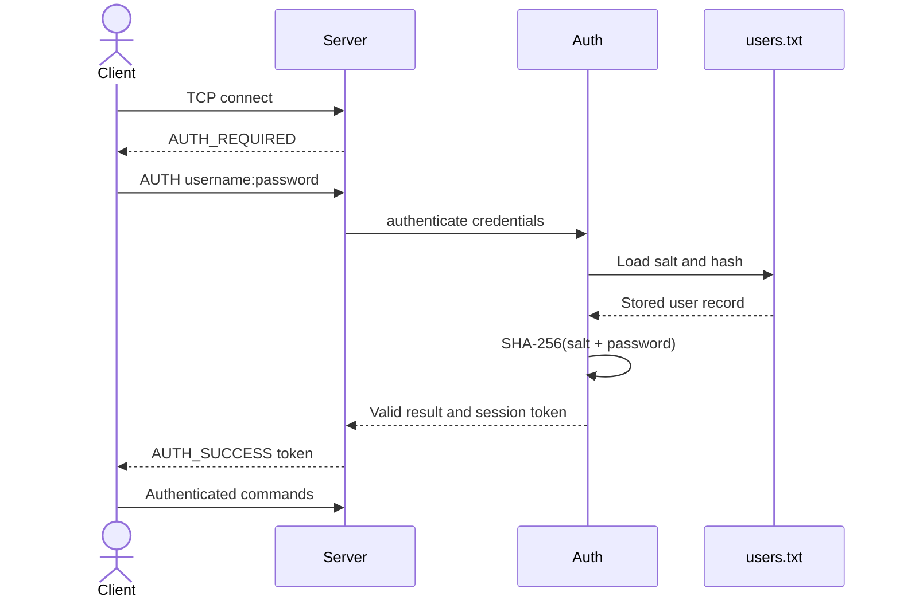
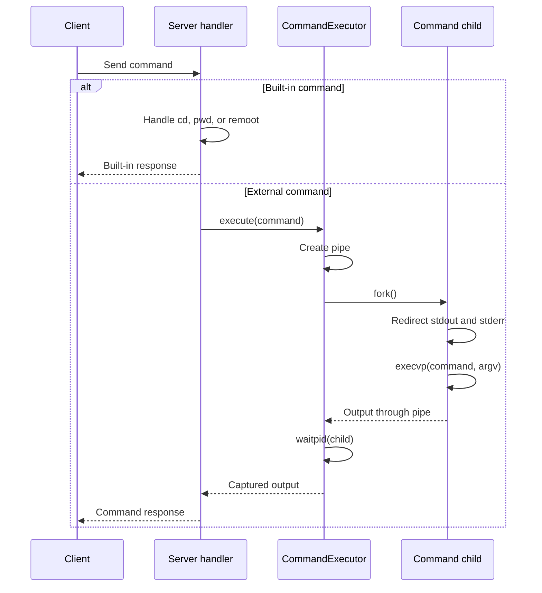
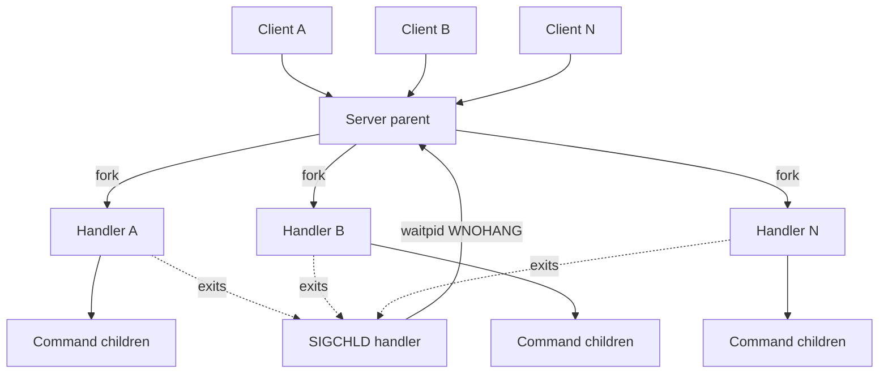

## System shape

Easy RSH separates network ownership, authentication, process execution, and configuration into small C++ classes.

## Main components

| Component | Responsibility |
| --- | --- |
| `Socket` | Move-only RAII wrapper around a POSIX socket descriptor |
| `Server` | Bind, listen, accept, authenticate, and route client messages |
| `Client` | Connect, complete login, and run the interactive prompt |
| `Auth` | Store salted hashes, verify credentials, and issue session tokens |
| `CommandExecutor` | Parse arguments, fork, execute, and capture output through a pipe |
| `Config` | Read and write the key-value server configuration |
| `SetupWizard` | Collect and validate first-run settings |

## Authentication flow

The server loads the stored salt for the user, calculates SHA-256 over `salt + password`, and compares the result with the persisted hash. On success, `RAND_bytes` provides entropy for a new session token.

## Command execution flow

Built-ins stay in the client handler because operations such as `chdir` must modify the long-lived session process. External commands are isolated in short-lived children.

## Multi-client model

With `--fork`, the listening server forks once per accepted client. The parent closes its copy of the client socket and immediately returns to `accept`. The child closes its copy of the listening socket and owns the connection until the session ends.

A `SIGCHLD` handler repeatedly calls `waitpid(..., WNOHANG)` to reap completed client processes and prevent zombies.

## State boundaries

- The parent owns the listening socket and restart loop.
- A forked handler owns one client connection and its current working directory.
- Command children are short lived and return output through a pipe.
- Session tokens are memory-only and disappear when the relevant process exits.
- Configuration and user hashes persist under `data/`.

This model favors readability and process isolation over maximum connection density. It is a good fit for demonstrating operating-system concepts, but it is not intended to compete with event-driven production SSH servers.
